<!-- ============================================================ Sai Likita — GitHub Profile README Generated with: terminal-card.svg, info-card.svg, github-contribution-animation.svg (from the animated-SVG kit) plus standard open-source badge/stat services (shields.io, github-readme-stats, streak-stats, readme-typing-svg, snk). ============================================================ --> <h1 align="center">Hi there, I'm Sai Likita 👋</h1> 
  
 
     
 
  
 <!-- ================= ASCII Portrait + Info Card ================= --> <table align="center"> <tr> <td></td> <td></td> </tr> </table>
🚀 About Me
🎓 B.Tech in Computer Science Engineering (AI/ML) — Mohan Babu University, Nellore, Andhra Pradesh · Class of 2027
💻 Full-stack developer with a strong foundation in Java, Python, SQL, DSA & OOP
🧠 Building AI/ML-powered applications — chatbots, automation agents, and LLM-based tools
🏢 Completed internships at NTS Nihon Global, Unified Mentor, and SmartBridge
🌱 Actively expanding a portfolio of full-stack and AI projects while applying for 2027-batch roles
⚡ Tech Stack

  

💼 Featured Projects
Project	Description	Link
🚕 sawari	Ride-booking application — flagship project	(add repo link)
🔐 EPLQ	Encrypted privacy-preserving location query app	Repo
🤖 Customer-Support-AI-Environment	AI-driven customer support platform	Repo
🛠️ support-ai-demo	Support-AI proof-of-concept demo	Repo
🔄 SAP-Style-Data-Reconciliation-Chatbot	Chatbot for SAP-style data reconciliation	Repo
📋 Ai-Attendence-Checker	Automated attendance detection tool	Repo
✈️ Airline-Management-System	Airline booking & management system	Repo
❓ interactive-quiz	Interactive quiz web application	Repo
🌐 portfolio-sailikita	Personal developer portfolio site	Repo
📈 GitHub Analytics

   
 
  
 
  
 <!-- Snake animation: rendered by .github/workflows/snake.yml — see that file's comments for the one-time setup steps required to make this image appear. --> 
  
 
  

<i>Thanks for stopping by — always open to interesting projects and full-time opportunities!</i>

